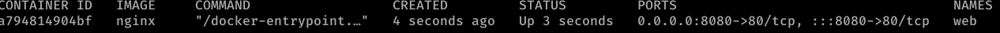
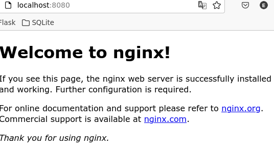
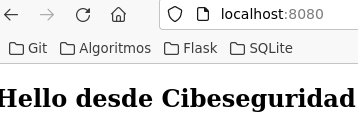
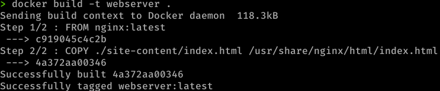
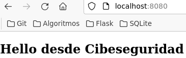
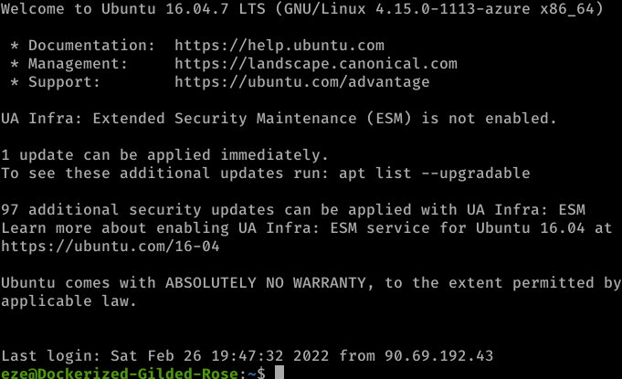
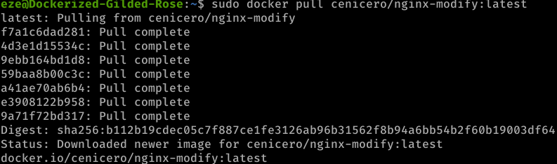

# Create a custom image with Docker

The task proposed by my mentor includes two sections. The first section teaches how to link a local directory with a directory belonging to the container itself. The second section shows how to create your own personalized image that can be used from different sites with the same result.

## Prerequisites

During the task we will use a web server called [nginx](https://www.nginx.com/) that will serve us to show HTML templates, which the added intention of this guide.

We will make use of an image already offered by [Dockerhub of nginx](https://hub.docker.com/_/nginx), we will add it to the Docker cache for later use, we will assign it a port to run on (remember that it is a server) and we will give the container a name.

First, let's pull the image from Dockerhub:

```
docker pull nginx
```

Inside the Docker cache we will have an nginx image available with the `nginx:latest` tag

Run a container with `nginx` image.

```
docker run --rm -d -p 8080:80 --name web nginx
```


Now if we visit our `localhost:8080` address, HTML default nginx template will appear.



## First Section: Bind mounts

The mounted volumes have a great utility that is to link directories of our local machine to directories of the container itself.

Nginx saves HTML files to `/usr/share/nginx/html`. We will mount a local file from our machine to the container with a custom HTML.

First create a directory on your local machine wherever you want and make an HTML file with your content.

In my case:

```
/home/dual/Documentos/whale-likes-web/site-content
```

```
<!doctype html>
<html lang="en">
<head>
  <meta charset="utf-8">
  <title>Docker Nginx</title>
</head>
<body>
  <h2>Hello desde Cibeseguridad</h2>
</body>
</html>
```

We will now run the past command to run the container with the new `-v` option which mounts a directory on our local machine to one in the container. In my case directories will be `~/Documentos/nginx/site-content` and `/usr/share/nginx/html`.

So, run:

```
docker run --rm -d -p 8080:80 --name web -v ~/Documentos/whale-likes-web/site-content:/usr/share/nginx/html nginx

```

And the result is the expected one:



## Second section: Custom Docker Image

Imagine that you want to move the image as it is to another container, without volumes and exclusively with Dockerfile. This is the objective of this section.

We will create a Dockerfile that is based on the `nginx` image that we have locally and we will copy with an instruction the content of our local machine to the container in which the image is based.

Inside the Dockerfile we set:

```
FROM nginx:latest
COPY ./site-content/index.html /usr/share/nginx/html/index.html
```

What this will do is copy our `index.html` file to the `/usr/share/nginx/html` directory inside the container, overwriting the default index.html file provided by nginx.

Let's build our image:

```
docker build -t webserver .
```



We can run our container without the need to create a mounted volume.

Let's get our container up and running.

```
docker run --rm -d -p 8080:80 --name web webserver
```



## Connect Microsoft Azure VM

I will make use of a virtual machine in Azure already created in another guide to run the container with the server inside it.

I connect to the Microsoft Azure virtual machine via SSH.



### Prerequisites

- Docker installed
- Docker daemon running
- Azure Virtual Machine created and running

### Upload image into Dockerhub repositories

In order not to have to replicate all the previous steps and recreate a new image, we will upload our image to Dockerhub.

The first thing will be to log in to Dockerhub from the CLI, you will be asked for your credentials Within Dockerhub you will create a repository that will host the image:

```
docker login
```

Rename the image with the repository name next to your username:

```
docker image tag webserver:latest cenicero/nginx-modify:latest
```

And push the image into the repository:

```
docker push cenicero/nginx-modify:latest
```

### Run container from VM

We have our image in Dockerhub, that means we can pull it from everywhere. Let's do it from our virtual machine.

```
docker pull cenicero/nginx-modify:latest
```



Run the container:

```
docker run --rm -d -p 8080:80 --name web cenicero/nginx-modify
```

If we make a `GET` request with curl from the virtual machine with the container running, we get the `index.html` content.

# Credits

This task is based in a [Docker blog entry](https://www.docker.com/blog/how-to-use-the-official-nginx-docker-image/)

An additional mention to my tutors [@maximofernandezriera](https://github.com/maximofernandezriera?tab=repositories) and [@dfleta](https://github.com/dfleta) for the mentoring.
